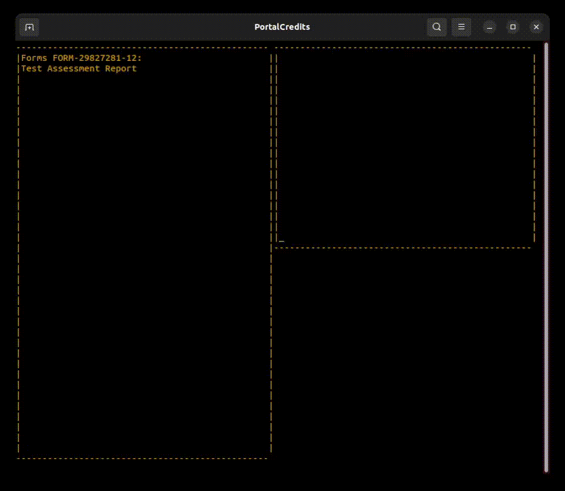

# PortalCredits

A console application displaying the end credits of Portal.

This is a fan project by a bored university student.

PortalCredits works on Windows and Linux (Tested on Ubuntu 22.10) through
xterm virtual terminal sequences and Winapi calls.

## Building

The release versions contain precompiled binaries. If you want to build the
program yourself, look at the [Building guide](doc/Build.md).

## Copyright Notice

All source files are licensed under the GNU GPL license. Some resources
(namely the [song lyrics](res/Lyrics.txt), the [credits](res/Credits.txt),
the [symbols](res/Symbols.txt), and the song itself) don't
belong to me, they belong to Valve and Jonathan Coulton. Therefore, they aren't
licensed by me.